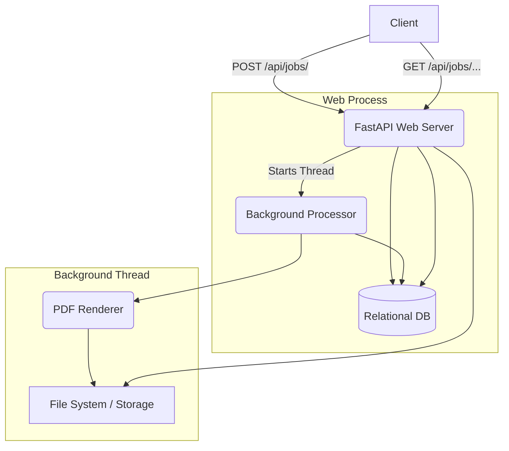

# Bulk Certificate Generator

A highly scalable, background-processing API for generating bulk PDF certificates, designed to handle up to 100k recipients reliably.

## Features
- **Idempotent Job Creation**: Safely retry requests without generating duplicate jobs.
- **Resilient Processing**: Per-recipient error handling ensures one bad name/email doesn't fail the entire batch.
- **Crash Recovery**: Jobs interrupted by a server crash are automatically resumed on startup.
- **Fast PDF Rendering**: Uses `reportlab` with embedded TTF fonts (Roboto) for complete Unicode support.
- **SQLite / PostgreSQL**: Defaults to SQLite for immediate out-of-the-box local setup, but easily switches to PostgreSQL for production.

---

## Demo


Run it yourself (with the server running):

    python scripts/demo.py

This submits 5 recipients (a normal name, a unicode name, a 90-character name,
an invalid recipient, and a duplicate email). Expected result: `COMPLETED_WITH_ERRORS`,
3 certificates generated, 2 failures with clear error messages.

Sample generated certificates are in [`docs/sample-output/`](docs/sample-output/).

---

## 1. Setup

### Prerequisites
- Python 3.12+

### Installation
Clone the repository and install dependencies:

```bash
python -m venv venv
source venv/bin/activate  # On Windows: venv\Scripts\activate
pip install -r requirements.txt
```

### Environment Variables
Copy the example environment file:
```bash
cp .env.example .env
```
The application will default to SQLite (`sqlite:///./dev.db`) for zero-configuration setup. For production or full integration, uncomment the `DATABASE_URL` line to use PostgreSQL.

---

## 2. Run

### Local Development (SQLite)
Run the application with `uvicorn`:
```bash
uvicorn app.main:app --reload
```
The API documentation will be available at `http://127.0.0.1:8000/docs`.

### Production (Docker & PostgreSQL)
To run the app and a PostgreSQL database via Docker Compose:
```bash
docker-compose up -d --build
```
*Note: Postgres is supported through DATABASE_URL but has not been tested against a live Postgres instance. All tests run on SQLite.*

---

## 3. Tests

Tests are written using `pytest`. They use an in-memory SQLite database and test the full API lifecycle, including idempotency, background job state tracking, failure isolation, and crash recovery.

```bash
pytest tests/
```
Or run with coverage:
```bash
pytest tests/ --cov=app
```

---

## 4. cURL Examples

**1. Submit a job**
```bash
curl -X POST "http://127.0.0.1:8000/api/jobs/" \
  -H "Content-Type: application/json" \
  -H "Idempotency-Key: job-run-123" \
  -d '{
    "title": "Python Bootcamp",
    "issuer_name": "Acme Academy",
    "issue_date": "2026-10-01",
    "recipients": [
      {"name": "Zoë Müller", "email": "zoe@example.com"},
      {"name": "Li Wei", "email": "li.wei@example.com"}
    ]
  }'
```

**2. Check Job Status**
```bash
curl "http://127.0.0.1:8000/api/jobs/<JOB_ID>/"
```

**3. List Certificates**
```bash
curl "http://127.0.0.1:8000/api/jobs/<JOB_ID>/certificates/?status=SUCCESS"
```

**4. Download a Single Certificate PDF**
```bash
curl -O -J "http://127.0.0.1:8000/api/jobs/<JOB_ID>/certificates/<CERTIFICATE_NUMBER>/"
```

**5. Download All Certificates as ZIP**
```bash
curl -O -J "http://127.0.0.1:8000/api/jobs/<JOB_ID>/download/"
```

---

## 5. Architecture Diagram



---

## 6. Design Decisions

- **Idempotency**: Implemented at the HTTP layer using a unique `Idempotency-Key` string stored on the `Job` row. If a job is created with the same key, we immediately return 200 OK with the existing job metadata.
- **Processing Choice**: We chose to use FastAPI's `BackgroundTasks` (which spawns a thread) for processing instead of a heavier queue like Celery. This keeps the setup simple and dependency-free for this assignment, while still allowing the main thread to immediately return a 202 Accepted response. 
- **Relational Integrity vs Performance**: Job and Recipient are strictly related, and `db.flush()` is used so `job.id` is fully accessible before spawning recipients. We commit after each recipient in the background thread to make progress immediately visible to the user.
- **Error Isolation**: The renderer is wrapped in a tight `try/except` loop. Rendering failures or invalid unicode errors simply mark the individual recipient as `FAILED` (capturing up to 300 chars of the exception string) and execution continues.
- **Font Selection**: Included Roboto (Apache 2.0 license) so that accents and foreign characters (e.g. Zoë Müller, 漢字) render seamlessly without failing ReportLab's standard font engine.

---

## 7. 100k Scaling

To support 100,000 certificates efficiently:
1. **Queueing System**: Replace `BackgroundTasks` with a dedicated queue broker (e.g., Celery + Redis or RabbitMQ).
2. **Chunking/Batching**: The job processing function currently fetches all `PENDING` recipients at once. At 100k scale, this would load 100k rows into memory. We would use `.yield_per(1000)` or paginate the background processing.
3. **Storage**: Replace local disk storage (`app/services/storage.py`) with Amazon S3 or Google Cloud Storage, allowing horizontal scaling of worker nodes.
4. **ZIP Creation**: Generating a ZIP of 100k PDFs synchronously will OOM or timeout the web request. We would transition ZIP generation to a background task itself, notifying the user when the `archive.zip` is fully uploaded to S3.

---

## 8. Future Scope

- **Template Support**: Allow clients to pass HTML or dynamic templates instead of a hard-coded canvas structure.
- **Email Delivery**: Once generated, dispatch the certificate automatically via an SMTP integration or SendGrid.
- **Webhooks**: Provide an asynchronous webhook URL when creating the job so the client doesn't need to poll `GET /api/jobs/{id}/`.

---

## 9. Known Limitations

- **Multiple Workers Startup Recovery**: If running with multiple uvicorn workers (`--workers 4`), each worker invokes `_run_startup_recovery()` independently, leading to the same jobs being resumed multiple times concurrently. To fix this in production, the recovery must use an atomic claim (e.g., `UPDATE jobs SET status='PROCESSING' WHERE id=X AND status='PENDING' RETURNING id;`) or offload to a true queuing system.
- **Synchronous ZIP Downloads**: The ZIP download reads all PDFs and bundles them on the fly during the HTTP request. This works fine for 500 certs, but will time out for huge jobs.
- **Storage Cleanup**: Temporary `.pdf` files and generated `.zip` files remain on disk. A cron job or TTL strategy should be implemented to delete stale files.

---

## 10. License

This project is licensed under the MIT License.
The included fonts (Roboto) are licensed under the Apache 2.0 License.
